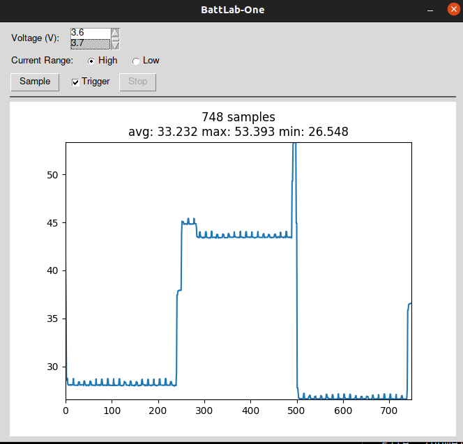

# README

The `battlab` module provides a Python 3 class for interacting with a [BattLab-One instrument](https://bluebird-labs.com/).

* Encapsulates serial protocol with instrument firmware
* Configure operating parameters
* Read samples of current readings
* Usable from CLI and GUI applications
* Cross-platform

The battery modeling feature of the original BattLab-One application is not implemented here. This module is solely for data acquisition.

Use `help(BattLabOne)` for docs.

A command-line utility is provided in `bl1cli.py`. Invoke using `python3 -m battlab` or `bl1cli` after installing via `setup.py` or `pip3 install`.

## Examples

From `examples/basic/main.py`:

``` python
from battlab import BattLabOne

def main():
    """Example usage of BattLabOne class"""
    bl1 = BattLabOne()
    bl1.reset()

    print("fw version: {}".format(bl1.version))
    print(bl1.VOLTAGES)

    bl1.current_range = BattLabOne.CurrentRange.HIGH

    bl1.voltage = 3.0

    data = bl1.take_n(bl1.sample(), 100)

    bl1.voltage = 0

    print(max(data), min(data), sum(data) / len(data))


if __name__ == "__main__":
    main()

```

CLI utility:

``` bash
linux% bl1cli --help
usage: bl1cli [-h] [-c {high,low}] [-d DURATION] [-g] [--no-reset] [-o OUTPUT] [-p PORT]
              [-v VOLTAGE] [-w WAIT]

Measure current with BattLab-One

optional arguments:
  -h, --help            show this help message and exit
  -c {high,low}, --current-range {high,low}
                        use high or low current range
  -d DURATION, --duration DURATION
                        duration of measurement (seconds)
  -g, --graph           graph (plot) the sample data
  --no-reset            do not reset device
  -o OUTPUT, --output OUTPUT
                        output file to store sample data in
  -p PORT, --port PORT  serial (com) port to use
  -v VOLTAGE, --voltage VOLTAGE
                        voltage for testing
  -w WAIT, --wait WAIT  wait seconds before sampling
```

See `examples/gui` for an example that uses [PySimpleGUI](https://pysimplegui.readthedocs.io/en/latest) and [matplotlib](https://matplotlib.org) for a simple GUI application including plotting.



## TODO

* Add support for triggered mode
* Add support for setting averaging
